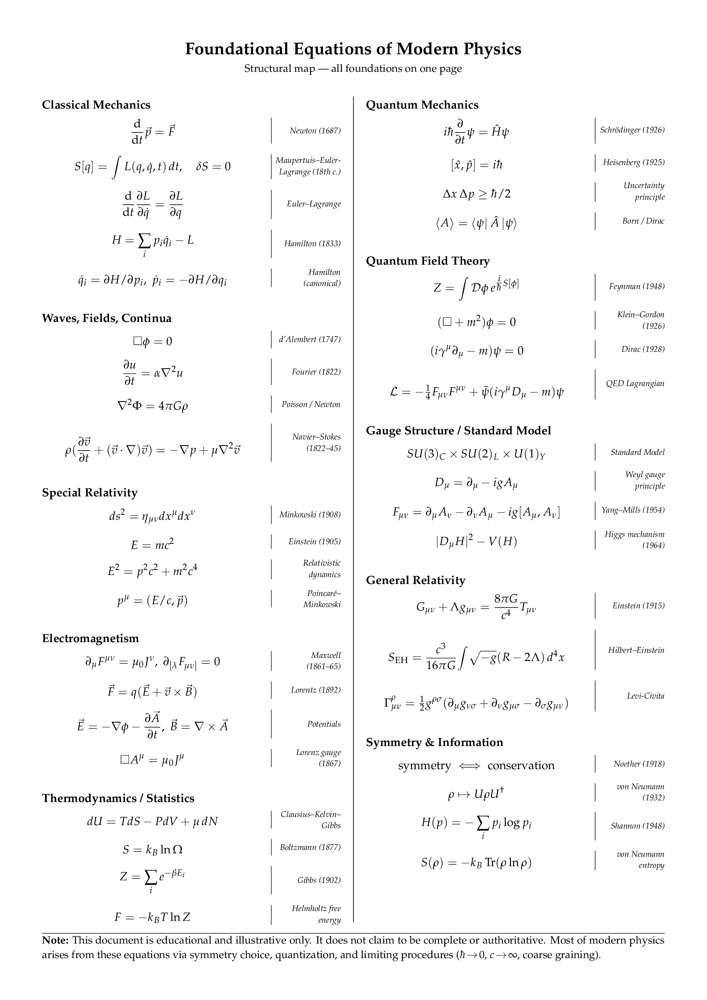

# Foundational Equations of Modern Physics

A one-page reference sheet containing the most important equations from classical mechanics to general relativity, organized by topic.

## Preview



*[Click here to view the full PDF](main.pdf)*

## Description

This document provides a comprehensive overview of foundational equations in modern physics, including:

- **Classical Mechanics**: Newton's laws, Lagrangian and Hamiltonian formulations
- **Waves, Fields, Continua**: Wave equations, fluid dynamics
- **Special Relativity**: Minkowski spacetime, relativistic dynamics
- **Electromagnetism**: Maxwell's equations, Lorentz force
- **Thermodynamics / Statistics**: Entropy, partition functions
- **Quantum Mechanics**: Schrödinger equation, uncertainty principle
- **Quantum Field Theory**: Path integrals, Dirac equation
- **Gauge Structure / Standard Model**: Yang-Mills theory, Higgs mechanism
- **General Relativity**: Einstein field equations
- **Symmetry & Information**: Noether's theorem, information theory

## Compilation

To compile the document, you need a LaTeX distribution (e.g., TeX Live, MiKTeX) with the following packages:

- `geometry`
- `multicol`
- `amsmath`, `amssymb`
- `physics`
- `mathpazo`
- `titlesec`

Compile with:

```bash
pdflatex main.tex
```

Or use your preferred LaTeX editor/compiler.

## License

This work is licensed under a [Creative Commons Attribution 4.0 International License](LICENSE).

You are free to:
- **Share** — copy and redistribute the material in any medium or format
- **Adapt** — remix, transform, and build upon the material for any purpose, even commercially

Under the following terms:
- **Attribution** — You must give appropriate credit, provide a link to the license, and indicate if changes were made. You may do so in any reasonable manner, but not in any way that suggests the licensor endorses you or your use.

See the [LICENSE](LICENSE) file for the full legal text.
